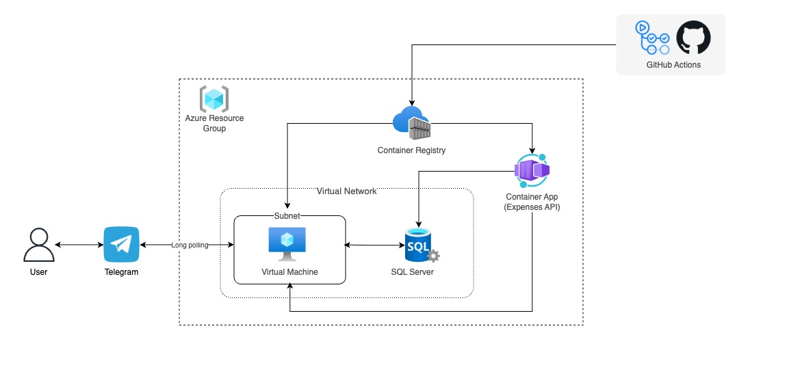

  

<b> Disclaimer Note⚠️: </b> AssistantBot is currently used exclusively as a personal assistant and is intended for private use only.

AssistantBot is a Telegram bot designed to provide practical and engaging features, making interactions efficient and informative. It serves as a personal assistant, offering a range of capabilities tailored to enhance productivity and communication.

## Features

### Conversational Interaction
By default, AssistantBot leverages Langchain and OpenAI's ChatGPT 3.5 APIs to facilitate engaging text-based conversations. It can answer a variety of user questions and provide responses with a personalized touch.

### Voice note communication
It is possible to interact with AssistantBot using voice notes. When AssistanBot receives a new voice note, it will process the content and provide contextually relevant responses. Additionally, it assesses pronunciation quality using Microsoft Azure's cognitive services and OpenAI's Whisper, offering self-assessment for language learners.

### Weather Updates
AssistantBot integrates with the OpenWeather API to provide weather updates in a conversational manner. Inquiries about temperature in different locations yield informative responses with a touch of personality.

### Vocabulary expansion
Use AssistantBot's random word command to receive English words along with explanations. This feature aids in improving vocabulary and language skills through exposure to diverse linguistic content.

### Grammar correction
AssistantBot assists with grammar correction. Send a message, and AssistantBot will identify and rectify grammatical errors using its language capabilities.

### Track my expenses
AssistantBot offers an expense tracking feature. It utilizes a FastAPI-based API to integrate with my Gmail notifications from my bank, storing relevant data in an Azure SQL database. This data, combined with the language model, yields concise financial summaries.

## Infraestructure Overview
AssistantBot is containerized with Docker and deployed as a long polling service inside an Azure Virtual Machine. The CI/CD process is carried out by workflows built in Github Actions.

The expenses API is a serverless service built with FastAPI and deployed on Azure Container Apps. The information is stored inside an Azure SQL Server Database.

  

